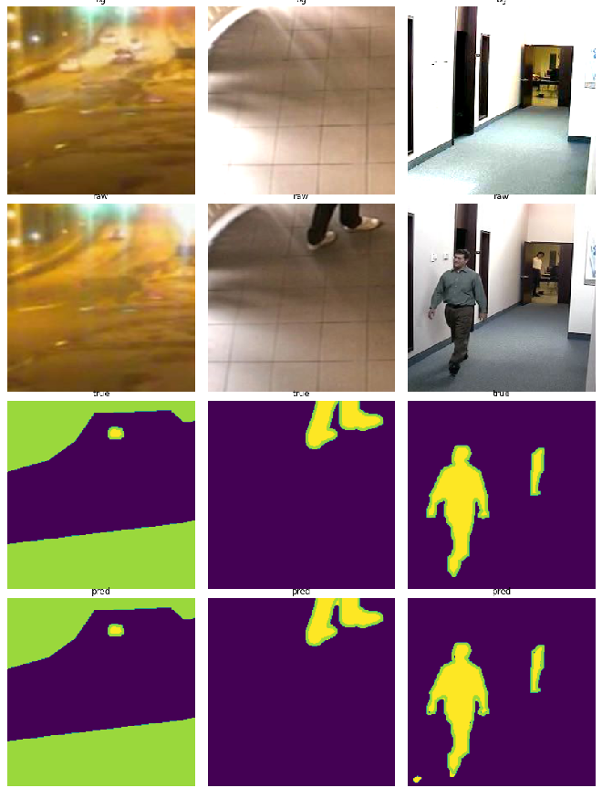

<!-- PROJECT SHIELDS -->
<!--
*** I'm using markdown "reference style" links for readability.
*** Reference links are enclosed in brackets [ ] instead of parentheses ( ).
*** See the bottom of this document for the declaration of the reference variables
*** for contributors-url, forks-url, etc. This is an optional, concise syntax you may use.
*** https://www.markdownguide.org/basic-syntax/#reference-style-links
-->
[![Status][developement-shield]][developement-shiled-url]
[![Contributors][contributors-shield]][contributors-url]
[![Forks][forks-shield]][forks-url]
[![Stargazers][stars-shield]][stars-url]
[![Issues][issues-shield]][issues-url]
[![MIT License][license-shield]][license-url]
[![LinkedIn][linkedin-shield]][linkedin-url]

<!-- PROJECT LOGO -->
 

  

  <h3 align="center">Fast Background Subtraction</h3>

  

    Light-weight and fast background subtraction model 
     
    <a href="https://rohitdavas.github.io/projects/Fast-Background-Subtraction.html"><strong>Explore the docs »</strong></a>
     
     
    <a href="https://github.com/rohitdavas/fast-background-subtraction">View Demo</a>
    ·
    <a href="https://github.com/rohitdavas/fast-background-subtraction/issues">Report Bug</a>
    ·
    <a href="https://github.com/rohitdavas/fast-background-subtraction/issues">Request Feature</a>
  

<!-- TABLE OF CONTENTS -->

  
<h2 style="display: inline-block">Table of Contents</h2>

  <ol>
    <li>
      <a href="#about-the-project">About The Project</a>
      <ul>
        <li><a href="#built-with">Built With</a></li>
      </ul>
    </li>
   <li><a href="#results"> Results </a> </li>
    <li><a href="#usage">Usage</a></li>
    <li><a href="#roadmap">Roadmap</a></li>
    <li><a href="#contributing">Contributing</a></li>
    <li><a href="#license">License</a></li>
    <li><a href="#contact">Contact</a></li>
    <li><a href="#acknowledgements">Acknowledgements</a></li>
  </ol>

<!-- ABOUT THE PROJECT -->
## About The Project

This repo includes the neural network training code for the lightweight BGS model. 

### Built With
[![PyTorch][pytorch-shield]][pytorch-shield-url] [![Qt5][qt-shield]][qt-shield-url] [![OpenCV][opencv-shield]][opencv-shield-url]

## Results
TODO : upload results of both synthetic as well as real-world dataset.
<!-- USAGE EXAMPLES -->
## Usage
Integration of `BGS Neural Network Model` into the BGS software is still pending. `BGS software` currently, uses
`opencv's MOG2` for Background subtraction. 

<!-- ROADMAP -->
## Roadmap

See the [open issues](https://github.com/rohitdavas/Fast-Background-Subtraction/issues) for a list of proposed features (and known issues).

<!-- CONTRIBUTING -->
## Contributing

Contributions are what make the open source community such an amazing place to be learn, inspire, and create. Any contributions you make are **greatly appreciated**.

1. Fork the Project
2. Create your Feature Branch (`git checkout -b feature/AmazingFeature`)
3. Commit your Changes (`git commit -m 'Add some AmazingFeature'`)
4. Push to the Branch (`git push origin feature/AmazingFeature`)
5. Open a Pull Request

<!-- LICENSE -->
## License

Distributed under the MIT License. See `LICENSE` for more information.

<!-- CONTACT -->
## Contact
[![twitter][twitter-shield]][twitter-shield-url]
[![email][email-shield]][email-shield-url]
[![linkedin][linkedin-shield]][linkedin-url]

<!-- ACKNOWLEDGEMENTS -->
## Acknowledgements
A work from the wonderful guidance and motivation from 
* [Dr. Nils Hasler](https://www.linkedin.com/in/nils-hasler-91734a12/)
* [Michal Ritcher](https://www.linkedin.com/in/michal-richter-595661154/)
* [Dr. Vinit Jakhetiya](https://www.linkedin.com/in/vinit-jakhetiya-ph-d-b2450a80/?originalSubdomain=in)

<!-- MARKDOWN LINKS & IMAGES -->
<!-- https://www.markdownguide.org/basic-syntax/#reference-style-links -->
[contributors-shield]: https://img.shields.io/github/contributors/rohitdavas/fast-background-subtraction.svg?style=for-the-badge
[contributors-url]: https://github.com/rohitdavas/fast-background-subtraction/graphs/contributors
[forks-shield]: https://img.shields.io/github/forks/rohitdavas/fast-background-subtraction.svg?style=for-the-badge
[forks-url]: https://github.com/rohitdavas/fast-background-subtraction/network/members
[stars-shield]: https://img.shields.io/github/stars/rohitdavas/fast-background-subtraction.svg?style=for-the-badge
[stars-url]: https://github.com/rohitdavas/fast-background-subtraction/stargazers
[issues-shield]: https://img.shields.io/github/issues/rohitdavas/fast-background-subtraction.svg?style=for-the-badge
[issues-url]: https://github.com/rohitdavas/fast-background-subtraction/issues
[license-shield]: https://img.shields.io/github/license/rohitdavas/fast-background-subtraction.svg?style=for-the-badge
[license-url]: https://github.com/rohitdavas/repo/blob/master/LICENSE
[linkedin-shield]: https://img.shields.io/badge/-LinkedIn-black.svg?style=for-the-badge&logo=linkedin&colorB=555
[linkedin-url]: https://linkedin.com/in/rohit-davas
[developement-shield]:../images/Under_Developement.svg
[developement-shiled-url]:https://github.com/rohitdavas/fast-background-subtraction
[pytorch-shield]:../images/pytorch_shield.svg
[opencv-shield]:../images/opencv_shield.svg
[qt-shield]:../images/qt_shield.svg
[pytorch-shield-url]:https://pytorch.org/
[qt-shield-url]:https://www.qt.io/
[opencv-shield-url]:https://opencv.org
[twitter-shield]:../images/Twitter_shield.svg
[twitter-shield-url]:https://twitter.com/rohitdavas
[email-shield]:../images/email_shield.svg
[email-shield-url]:https://rohitdavas.github.io/